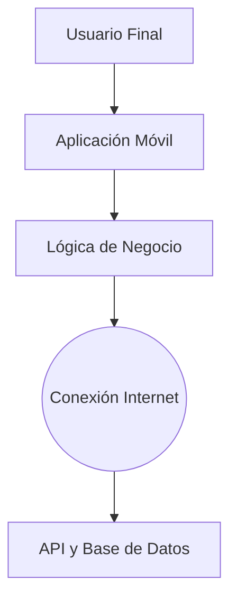

# Documentación General del Proyecto MexiPartes

Este documento consolida la información estratégica, técnica y funcional del proyecto MexiPartes. Su propósito es definir qué es el sistema, para quién está construido y cómo funciona internamente.

## 1. Descripción del Proyecto

MexiPartes es una plataforma de comercio electrónico especializada en refacciones automotrices. Nace para resolver la dificultad que enfrentan los conductores y mecánicos al buscar piezas específicas, centralizando el inventario y garantizando la compatibilidad entre la refacción y el vehículo.

El objetivo principal es eliminar la incertidumbre en la compra: que el usuario tenga la seguridad de que la pieza que está pidiendo es la correcta para su coche, sin necesidad de ser un experto en mecánica.

### Público Objetivo
La aplicación está diseñada para atender a tres perfiles principales:
1.  **Dueños de vehículos**: Personas que buscan reparar o mantener su auto personal.
2.  **Mecánicos Independientes**: Profesionales que requieren un proveedor confiable y rápido.
3.  **Vendedores**: Refaccionarias que utilizan la plataforma como canal de ventas digital.

## 2. Plataformas y Alcance

El desarrollo utiliza tecnología que permite desplegar la aplicación en los ecosistemas más importantes con un único código base:
-   **Dispositivos Móviles**: Compatible con teléfonos Android y iPhone (iOS).

## 3. Requerimientos del Sistema

### Requerimientos Funcionales
Son las acciones concretas que el sistema permite realizar a los usuarios:

-   **Gestión de Cuentas**: Registro de nuevos usuarios, inicio de sesión seguro y recuperación de acceso vía correo electrónico.
-   **Mi Garage**: Funcionalidad que permite al usuario registrar sus vehículos (Marca, Modelo, Año) para personalizar las búsquedas.
-   **Búsqueda y Catálogo**: Un buscador que localiza piezas por nombre o número de parte, y un catálogo que se puede explorar por categorías.
-   **Filtro de Compatibilidad**: El sistema debe filtrar automáticamente los resultados para mostrar solo las piezas compatibles con el vehículo seleccionado en "Mi Garage".
-   **Proceso de Compra**: Carrito de compras que permite agregar múltiples productos, calcular el total y gestionar la dirección de entrega.
-   **Historial de Pedidos**: Sección para consultar compras anteriores y verificar el estado del envío.

### Requerimientos No Funcionales
Son las características de calidad que debe cumplir el sistema:

-   **Rendimiento**: La navegación entre pantallas debe ser fluida y la carga de productos rápida.
-   **Seguridad**: Toda la información sensible, como contraseñas, se almacena encriptada. La comunicación con el servidor es segura.
-   **Disponibilidad**: El sistema debe estar operativo para recibir pedidos en cualquier momento.
-   **Diseño**: Se utiliza una interfaz en modo oscuro para reducir el consumo de batería en móviles y ofrecer una estética moderna.

## 4. Arquitectura y Diseño Técnico

El proyecto sigue una estructura de software conocida como MVVM (Modelo-Vista-VistaModelo), lo que facilita su mantenimiento y crecimiento a largo plazo.

### Componentes Principales
1.  **Interfaz de Usuario (Vista)**: Son las pantallas que el usuario ve y toca.
2.  **Lógica de Negocio (VistaModelo)**: Es el intermediario que procesa las reglas (ejemplo: validar que el correo sea correcto antes de enviarlo).
3.  **Datos y Servicios**: Es la capa que se conecta a internet para enviar y recibir información de la base de datos central.

### Diagrama Simplificado de Flujo

## 5. Escalabilidad

El proyecto ha sido construido pensando en el crecimiento futuro:

-   **Expansión de Plataformas**: Al estar desarrollado en Flutter, la aplicación está lista para expandirse a Web o Escritorio en el futuro con un esfuerzo mínimo, aunque actualmente se enfoca 100% en la experiencia móvil.
-   **Crecimiento del Backend**: La base de datos y el servidor están separados de la aplicación móvil, lo que permite mejorar la potencia del servidor sin obligar a los usuarios a actualizar su aplicación.
## 6. Metodología de Desarrollo

Para el desarrollo de MexiPartes utilizamos la metodología **Ágil (Scrum)**, dividiendo el trabajo en fases incrementales (Sprints) que nos permitieron evolucionar el producto de manera constante.

Este enfoque iterativo se estructuró de la siguiente manera:
-   **Planificación**: Definición de los objetivos clave para cada etapa (ej. "Tener listo el login").
-   **Desarrollo**: Construcción de las pantallas y conexión con la base de datos.
-   **Revisión**: Pruebas de funcionamiento para asegurar que lo construido sirve realmente al usuario.

Gracias a esta metodología, el proyecto pudo avanzar desde un prototipo visual hasta una aplicación funcional, adaptándose a los cambios y correcciones sobre la marcha sin detener el progreso general.
